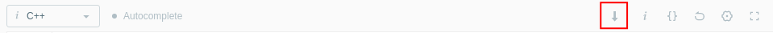

# Leetcode Extension

*  Add a download button to the toolbar which enables users to download their code displayed in the editor. 

The default filename is "{problemID}-{problemTitle}.{fileExtension}".

## Changelog

### 0.1.0

*  Add a download button to the toolbar.